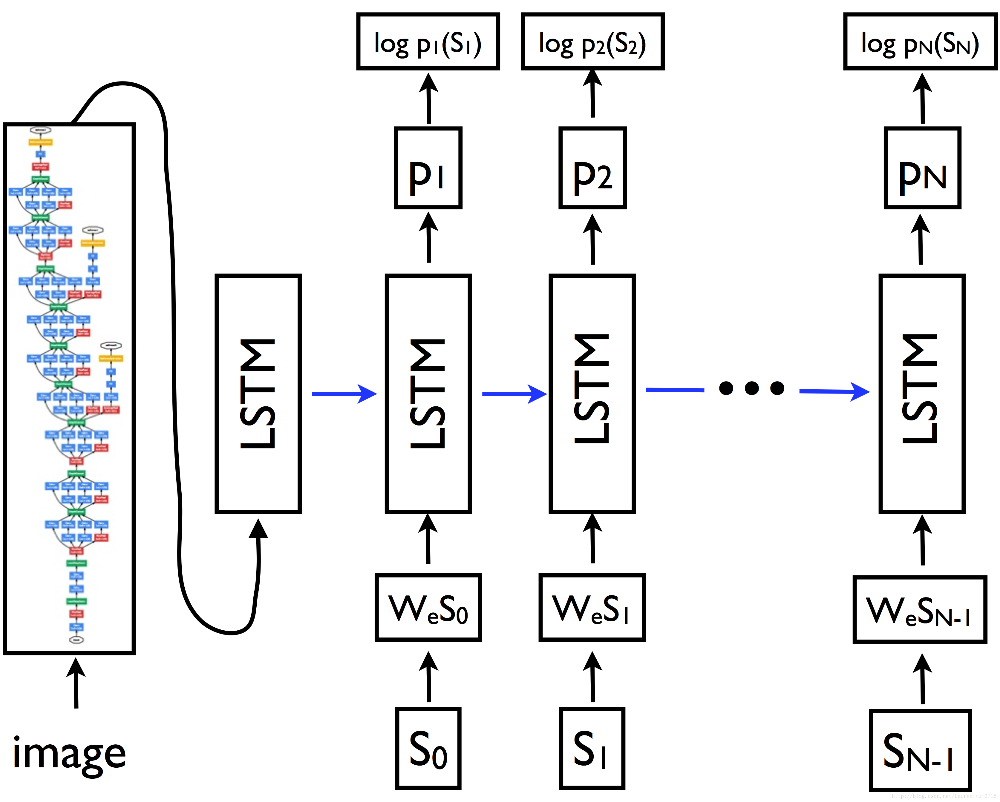

# 第一周项目进度汇报

## 1.项目介绍

###      1.1 选题原因

​	这个项目是一个融合了计算机视觉、自然语言处理的综合问题。首先是因为兴趣，从整个课程来看，对这方面比较感兴趣。再者，计算机视觉领域和自然语言处理领域现在正在落地的项目逐渐增多，逐渐的在我们身边使用，例如，计算机视觉领域，有人脸解锁、AI照相机、美颜相机等日常体验到的部分，将来还会在无人驾驶、机器人等方面还会有利用；又如自然语言处理领域，身边常见的聊天机器人、小爱音箱、天猫精灵等智能音箱、微信聊天的语音转换成文字都和自然语言处理相关。这两方面在今后肯定还会有更过的落地项目接近我们的生活，在未来比较有前景，因此选择了这个题目作为课程的结业项目。 

###      1.2 项目介绍

​	根据图片的内容自动的生成对图片的描述。这是项目主要需要实现的目标。具体就是需要根据传入的图片，需要模型能够根据传入的图片的内容生成一段英文描述，这段描述文字可以概括图片的大致内容，简称看图说话机器人。

## 2.资料查阅

###       2.1 Google《Show and Tell》

​	Google分别在2015年和2016年发表了《Show and Tell》和其优化的论文，并且在tensorflow中将其代码开源。该论文的思路，来自于在机器翻译上的进展，即通过最大化序列的似然概率，实现源语言到目标语言的序列翻译。主要结构是Encoder（RNN）+Decoder（RNN）实现。于是，作者考虑通过替换RNN机器翻译模型中的编码器为CNN网络，实现Image Caption。

原因如下：**编码器目的在于抽象特征为固定长度向量，而CNN已被证实具有描述图像特征的功能，因此可以预先训练图片分类模型** 。在本文中，使用一个CNN网络作为图像编码器，并在物体识别任务中预训练参数，将最后一个隐含层输入到RNN解码器中。这个模型被称为Neutral Image Caption（NIC）。

​	如上图所示，就是模型的结构图。传入的图片经过一个CNN模型，这个CNN模型使用的是Inception_v3模型，对传入的图片转换成一个固定长度的向量表示，再将这个向量传入下面的长短期记忆 (LSTM)网络作为第一个输入，其中后面的输入 {s0, s1, …, sN-1}是训练图片的描述句子的每个单词，{wes0, wes1, …, wesN-1} 是它们相应的词嵌入向量，输出 {p1, p2, …, pN}为模型句子中的下一个单词生成的概率分布， {log p1(s1), log p2(s2), …, log pN(sN)} 是每个步骤中正确单词的对数似然值，这些项的否定总和就是模型的最小化目标。 

​	在本篇论文中，各个时刻的LSTM单元共享一套参数，图像经过一次输入生成编码传入LSTM。

模型的损失函数：
$$
L(I,S)=−∑^N_{t=1} logp_t(S_t)
$$
​	输出的方法是使用的BeamSearch方法，也就是第一个时间点，输出top k个候选词，这k个候选词分别输入第二个时间维，得到若干第一个和第二个词组合，从这选择得分top k的，输入第三个时间维，依次迭代。最终选择top k的句子。

## 3.数据准备

可选的数据集：MSCOCO、Flickr30k、Flickr8k

选择数据集前，对比三个数据集的格式和内容。

每个数据集都是包含图片和句子的简单描述。其中每张图包含5句话的描述。训练的时候就是根据训练集的每张图片的描述去训练出“图片翻译”模型。

其中每个数据集的样本数量如下：

| Database     | 训练集 | 评估集 | 测试集 | 文字标注 |
| ------------ | ------ | ------ | ------ | -------- |
| MSCOCO(2014) | 82783  | 40504  | 40775  | 5句描述  |
| Flickr30k    | 28000  | 1000   | 1000   | 5句描述  |
| Flickr8k     | 6000   | 1000   | 1000   | 5句描述  |

 	由于MSCOCO数据集量比较大，加上做成tfrecord格式进行数据处理后的数据，需要至少150G的内存，训练耗时也比较久。因此考虑到项目的周期，我们采用了数据量稍微小点的Flickr8k数据集进行训练和验证。在后面如果还有时间我们会根据论文复现Flickr30k和MSCOCO数据集的效果和总结优缺点。

​	下载Flickr8k数据集，并把数据集在本地转换成tfrecord格式的数据集，大约有5G左右，上传至Tinymind备用。

## 4.方案规划

​	我们采用的模型就是根据Google《Show and Tell》论文中的模型，Inception_v3+LSTM。

​	需要首先下载inception_v3的ImageNet预训练模型 :

​	http://download.tensorflow.org/models/inception_v3_2016_08_28.tar.gz 

​        根据论文的描述的模型和设置的一些参数进行模型训练。

## 5.系统规划

 现在的基本的想法是先实现命令行直接指定待识别文件，然后输出描述语句。在时间充裕的情况下会考虑搭建一个简单的web界面，使用表单上传图片，然后页面输出最终的描述和图片。

